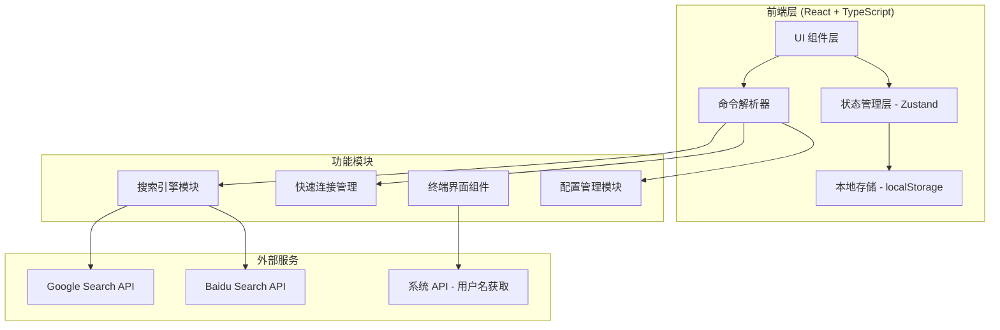

# 浏览器起始页技术架构文档

## 1. 架构设计



## 2. 技术选型

### 2.1 技术栈
- **前端框架**: React 18 + TypeScript
- **构建工具**: Vite
- **样式方案**: Tailwind CSS 3
- **状态管理**: Zustand
- **开发语言**: TypeScript (ES2020+)

### 2.2 项目初始化
- **初始化工具**: vite-init
- **模板**: react-ts
- **包管理器**: pnpm (优先) / npm

## 3. 目录结构

```
src/
├── components/          # 可复用组件
│   ├── Terminal/       # 终端相关组件
│   │   ├── Terminal.tsx          # 主终端容器
│   │   ├── CommandLine.tsx       # 命令输入行
│   │   ├── OutputDisplay.tsx     # 输出显示区域
│   │   └── Cursor.tsx            # 自定义光标组件
│   ├── ConfigPanel/    # 配置面板组件
│   │   └── ConfigPanel.tsx
│   └── QuickLinkCard/  # 快速连接卡片
│       └── QuickLinkCard.tsx
├── hooks/              # 自定义 Hooks
│   ├── useCommandParser.ts      # 命令解析 Hook
│   ├── useLocalStorage.ts       # 本地存储 Hook
│   ├── useSystemInfo.ts         # 系统信息获取 Hook
│   └── useProxyDetection.ts     # 代理检测 Hook
├── store/              # Zustand 状态管理
│   └── useTerminalStore.ts      # 终端状态 Store
├── utils/              # 工具函数
│   ├── commands.ts                # 命令处理逻辑
│   ├── searchEngine.ts           # 搜索引擎逻辑
│   ├── storage.ts               # 存储操作封装
│   └── validators.ts            # 输入验证函数
├── types/              # TypeScript 类型定义
│   └── index.ts                    # 共享类型定义
├── App.tsx             # 应用入口
├── main.tsx            # 渲染入口
└── index.css           # 全局样式
```

## 4. 路由定义

本项目为单页应用，无需路由配置，所有功能在同一页面内通过命令行交互完成。

## 5. 数据模型

### 5.1 类型定义

```typescript
// 快速连接类型
interface QuickLink {
  id: string;
  name: string;
  url: string;
  icon?: string;        // 网站 favicon
  createdAt: number;
}

// 配置类型
interface AppConfig {
  backgroundImage?: string;    // 背景图片 URL 或 base64
  backgroundColor: string;     // 背景色（无图片时使用）
  cursorColor: string;         // 光标颜色
  cursorStyle: 'blink' | 'static' | 'underline' | 'block';  // 光标样式
  theme: 'dark' | 'light';     // 主题模式
}

// 历史命令类型
interface HistoryEntry {
  command: string;
  timestamp: number;
  output?: string;
}

// 终端状态类型
interface TerminalState {
  username: string;                  // 当前用户名
  currentInput: string;              // 当前输入内容
  history: HistoryEntry[];           // 命令历史
  quickLinks: QuickLink[];           // 快速连接列表
  config: AppConfig;                 // 应用配置
  isConfigMode: boolean;             // 是否处于配置模式
}
```

### 5.2 存储结构

localStorage 键值对:
- `homepage_quicklinks`: JSON 序列化的 QuickLink 数组
- `homepage_config`: JSON 序列化的 AppConfig 对象
- `homepage_command_history`: JSON 序列化的 HistoryEntry 数组

## 6. 核心模块设计

### 6.1 命令解析器 (Command Parser)

**职责**：解析用户输入的命令字符串，识别命令类型和参数

```typescript
interface ParsedCommand {
  command: 'use' | 'search' | 'add' | 'list' | 'config' | 'clear' | 'help' | 'unknown';
  args: string[];
  raw: string;
}
```

**处理流程**:
1. 接收原始输入字符串
2. 去除首尾空格
3. 提取第一个词作为命令名
4. 其余部分作为参数数组
5. 返回结构化的命令对象

### 6.2 搜索引擎模块 (Search Engine)

**职责**：根据网络环境选择合适的搜索引擎并执行搜索

**核心逻辑**:
1. 检测代理可用性（超时时间: 3秒）
2. 可用 → 构建谷歌搜索 URL
3. 不可用 → 构建百度搜索 URL
4. 使用 `window.open()` 在新标签页打开

**URL 格式**:
- Google: `https://www.google.com/search?q=${encodeURIComponent(query)}`
- Baidu: `https://www.baidu.com/s?wd=${encodeURIComponent(query)}`

### 6.3 快速连接管理 (Quick Links Manager)

**职责**：管理用户的快速连接列表 CRUD 操作

**核心功能**:
- 添加新连接（验证 URL 有效性）
- 删除连接（通过 ID）
- 列出所有连接
- 选择并跳转到指定连接
- 数据持久化到 localStorage

### 6.4 配置管理模块 (Config Manager)

**职责**：管理应用的外观配置

**可配置项**:
- 背景图片（支持文件上传或 URL 输入）
- 背景颜色（颜色选择器）
- 光标颜色（颜色选择器）
- 光标样式（下拉选择）
- 所有配置实时预览并自动保存

### 6.5 系统信息模块 (System Info)

**职责**：获取操作系统相关信息

**实现方案**:
由于浏览器安全限制，无法直接获取操作系统用户名，采用以下策略：
1. 尝试通过 WebAPI 获取（有限支持）
2. 提供默认用户名 "guest"
3. 允许用户在配置中自定义用户名

## 7. 性能优化策略

### 7.1 渲染优化
- 使用 React.memo 优化组件重渲染
- 虚拟滚动处理大量历史命令输出
- CSS 动画使用 GPU 加速（transform, opacity）

### 7.2 资源优化
- 背景图片懒加载和压缩
- 字体文件使用 subset 减小体积
- 使用 CSS 变量统一管理主题色

### 7.3 用户体验优化
- 命令历史本地缓存
- 输入防抖处理
- 光标动画性能优化（requestAnimationFrame）

## 8. 安全考虑

### 8.1 XSS 防护
- 对所有用户输入进行 HTML 转义
- 使用 DOMPurify 清理用户生成内容
- 避免 dangerouslySetInnerHTML 或谨慎使用

### 8.2 数据安全
- 敏感配置信息仅存储在客户端
- 不向外部服务器发送任何数据
- URL 验证防止 javascript: 协议注入

## 9. 浏览器兼容性

- Chrome/Edge 90+
- Firefox 88+
- Safari 14+
- 移动端浏览器基本支持（响应式适配）

## 10. 开发规范

### 10.1 代码风格
- 使用 ESLint + Prettier 统一代码格式
- TypeScript strict 模式
- 组件采用函数式 + Hooks
- 文件命名：PascalCase for components, camelCase for utils

### 10.2 Git 提交规范
- feat: 新功能
- fix: 修复 bug
- refactor: 重构
- style: 样式调整
- docs: 文档更新
- perf: 性能优化
